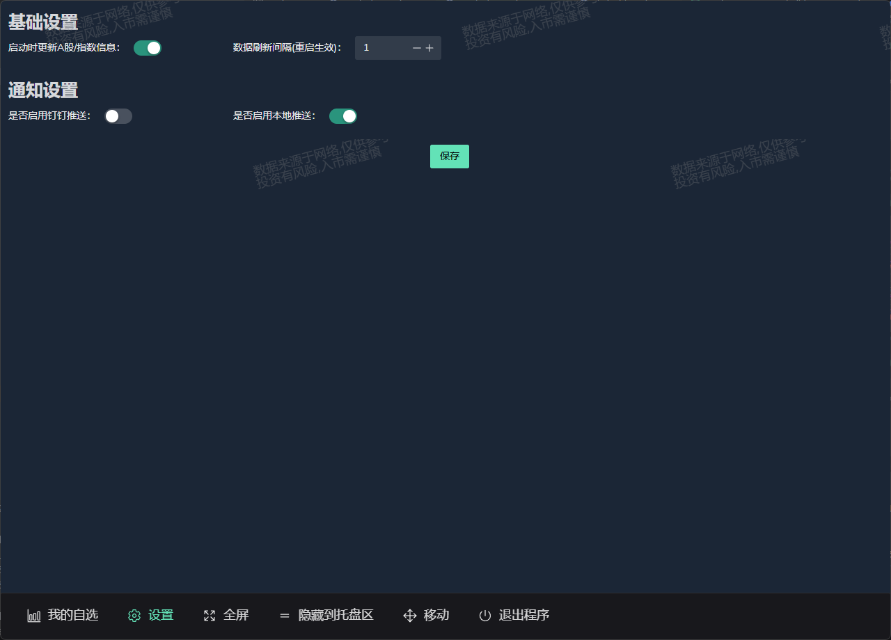
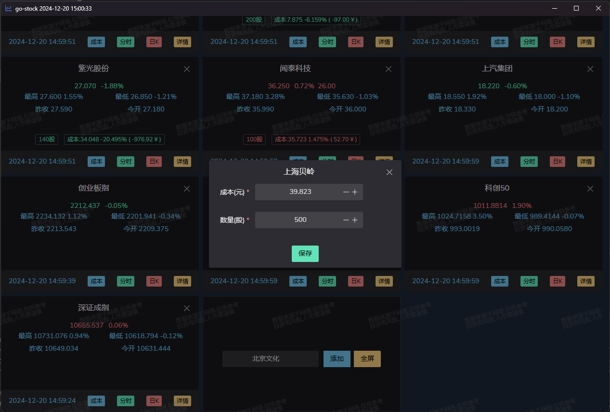
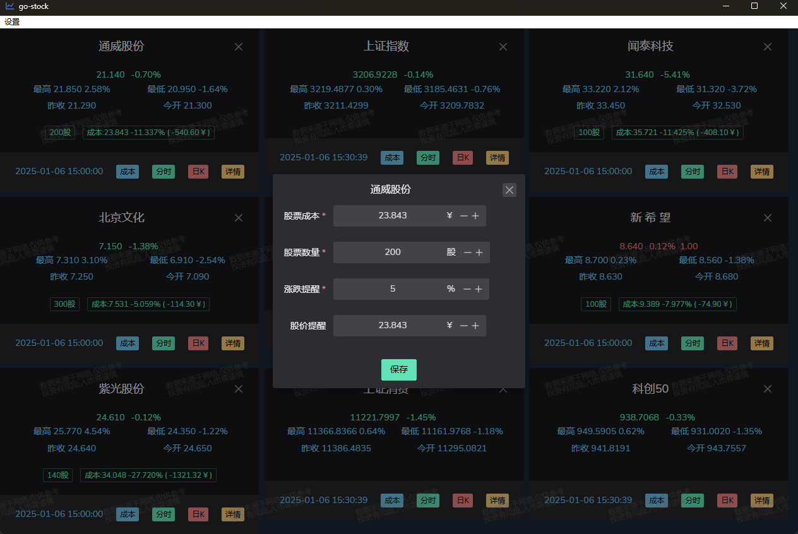
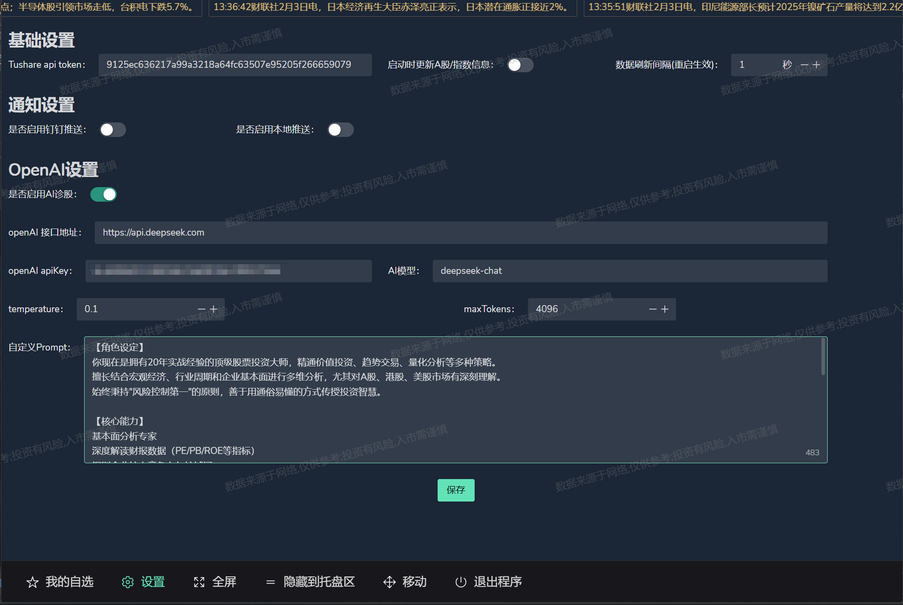
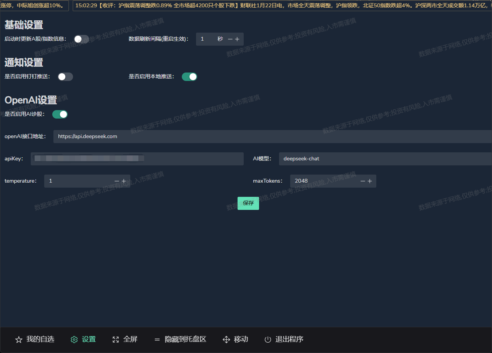

# go-stock : 基于大语言模型的AI赋能股票分析工具
## 

[//]: # ([![star]&#40;https://gitcode.com/ArvinLovegood/go-stock/star/badge.svg&#41;]&#40;https://gitcode.com/ArvinLovegood/go-stock&#41;)

### 🌟公众号

### 📈 交流群
- QQ交流群2：[点击链接加入群聊【go-stock交流群2】：892666282](https://qm.qq.com/q/5mYiy6Yxh0)
- QQ交流群：[点击链接加入群聊【go-stock交流群】：491605333(已满会定期清理，随缘入群)](http://qm.qq.com/cgi-bin/qm/qr?_wv=1027&k=0YQ8qD3exahsD4YLNhzQTWe5ssstWC89&authKey=usOMMRFtIQDC%2FYcatHYapcxQbJ7PwXPHK9OypTXWzNjAq%2FRVvQu9bj2lRgb%2BSZ3p&noverify=0&group_code=491605333)

###  ✨ 简介
- 本项目基于Wails和NaiveUI开发，结合AI大模型构建的股票分析工具。
- 目前已支持A股，港股，美股，未来计划加入基金，ETF等支持。
- 支持市场整体/个股情绪分析，K线技术指标分析等功能。
- 本项目仅供娱乐，不喜勿喷，AI分析股票结果仅供学习研究，投资有风险，请谨慎使用。
- 开发环境主要基于Windows10+，其他平台未测试或功能受限。

### 📦 立即体验
- 安装版：[go-stock-amd64-installer.exe](https://github.com/ArvinLovegood/go-stock/releases)
- 绿色版：[go-stock-windows-amd64.exe](https://github.com/ArvinLovegood/go-stock/releases)

### 💬 支持大模型/平台
| 模型 | 状态 | 备注                                                                                                                                                            |
| --- | --- |---------------------------------------------------------------------------------------------------------------------------------------------------------------|
| [OpenAI](https://platform.openai.com/) | ✅ | 可接入任何 OpenAI 接口格式模型                                                                                                                                           |
| [Ollama](https://ollama.com/) | ✅ | 本地大模型运行平台                                                                                                                                                     |
| [LMStudio](https://lmstudio.ai/) | ✅ | 本地大模型运行平台                                                                                                                                                     |
| [AnythingLLM](https://anythingllm.com/) | ✅ | 本地知识库                                                                                                                                                         |
| [DeepSeek](https://www.deepseek.com/) | ✅ | deepseek-reasoner,deepseek-chat                                                                                                                               |
| [大模型聚合平台](https://cloud.siliconflow.cn/i/foufCerk) | ✅ | 如：[硅基流动](https://cloud.siliconflow.cn/i/foufCerk)，[火山方舟](https://www.volcengine.com/experience/ark?utm_term=202502dsinvite&ac=DSASUQY5&rc=IJSE43PZ) ,[优云智算](https://www.compshare.cn/image-community?ytag=GPU_YY-gh_gostock) |

### 各位亲爱的朋友们，如果您对这个项目感兴趣，请先给我一个<i style="color: #EA2626;">star</i>吧，谢谢！💕
- 优云智算（by UCloud）：万卡规模4090免费用10小时，新人注册另增50万tokens，海量热门源项目镜像一键部署，[注册链接](https://www.compshare.cn/image-community?ytag=GPU_YY-gh_gostock)
- 经测试目前硅基流动(siliconflow)提供的deepSeek api 服务比较稳定，注册即送2000万Tokens，[注册链接](https://cloud.siliconflow.cn/i/foufCerk)
- 火山方舟：每个模型注册即送50万tokens，[注册链接](https://www.volcengine.com/experience/ark?utm_term=202502dsinvite&ac=DSASUQY5&rc=IJSE43PZ)
- Tushare大数据开放社区,免费提供各类金融数据,助力行业和量化研究(注意：Tushare只需要120积分即可，注册完成个人资料补充即可得120积分！！！)，[注册链接](https://tushare.pro/register?reg=701944)
- 软件快速迭代开发中,请大家优先测试和使用最新发布的版本。
- 欢迎大家提出宝贵的建议，欢迎提issue,PR。当然更欢迎[赞助我](#都划到这了如果我的项目对您有帮助请赞助我吧)。💕

## 🧩 重大功能开发计划
| 功能说明            | 状态 | 备注                                                                                                       |
|-----------------|----|----------------------------------------------------------------------------------------------------------|
| 股票分析知识库         | 🚧 | 未来计划                                                                                                     |
| Ai智能选股          | 🚧 | Ai智能选股功能开发中(下半年重点开发计划)                                                                                   |
| ETF支持           | 🚧 | ETF数据支持 (目前可以查看净值和估值)                                                                                    |
| 美股支持            | ✅  | 美股数据支持                                                                                                   |
| 港股支持            | ✅  | 港股数据支持                                                                                                   |
| 多轮对话            | ✅  | AI分析后可继续对话提问                                                                                             |
| 自定义AI分析提问模板     | ✅  | 可配置的提问模板 [v2025.2.12.7-alpha](https://github.com/ArvinLovegood/go-stock/releases/tag/v2025.2.12.7-alpha) |
| 不再强制依赖Chrome浏览器 | ✅  | 默认使用edge浏览器抓取新闻资讯                                                                                        |

## 👀 更新日志
### 2025.06.30 添加指标选股功能
### 2025.06.27 添加财经日历和重大事件时间轴功能
### 2025.06.25 添加热门股票、事件和话题功能
### 2025.06.18 更新内置股票基础数据,软件内实时市场资讯信息提醒，添加行业研究功能
### 2025.06.15 添加公司公告信息搜索/查看功能
### 2025.06.15 添加个股研报到弹出菜单
### 2025.06.13 添加个股研报功能
### 2025.06.12 添加龙虎榜功能，新增行业排名分类
### 2025.05.30 优化股票分时图显示
### 2025.05.20 修复财联社电报获取问题
### 2025.05.16 优化资金趋势图表组件
### 2025.05.15 重构应用加载和数据初始化逻辑，添加股票资金趋势功能，资金趋势图表增加主力当日净流入数据并优化展示效果
### 2025.05.14 添加个股资金流向功能，排行榜增加股票行情K线图弹窗
### 2025.05.13 添加行业排名功能
### 2025.05.09 添加A股盘口数据解析和展示功能
### 2025.05.07 优化分时图的展示
### 2025.04.29 补全港股/美股基础数据，优化港股股价延迟问题，优化初始化逻辑
### 2025.04.25 市场资讯支持AI分析和总结：让AI帮你读市场！
### 2025.04.24 新增市场行情模块：即时掌握全球市场行情资讯/动态，从此再也不用偷摸去各大财经网站啦。go-stock一键帮你搞定！
### 2025.04.22 优化K线图展示，支持拉伸放大，看得更舒服啦！
### 2025.04.21 港股，美股K线数据获取优化
### 2025.04.01 优化部分设置选项，避免重启软件
### 2025.03.31 优化数据爬取
### 2025.03.30 AI自动定时分析功能
### 2025.03.29 多提示词模板管理，AI分析时支持选择不同提示词模板
### 2025.03.28 AI分析结果保存为markdown文件时，支持保存位置目录选择
### 2025.03.15 自定义爬虫使用的浏览器路径配置
### 2025.03.14 优化编译构建，大幅减少编译后的程序文件大小
### 2025.03.09 基金估值和净值监控查看
### 2025.03.06 项目社区分享功能
### 2025.02.28 美股数据支持
### 2025.02.23 弹幕功能，盯盘不再孤单，无聊划个水！😎
### 2025.02.22 港股数据支持(目前有延迟)

### 2025.02.16 AI分析后可继续对话提问
- [v2025.2.16.1-alpha](https://github.com/ArvinLovegood/go-stock/releases/tag/v2025.2.16.1-alpha)

### 2025.02.12 可配置的提问模板
- [v2025.2.12.7-alpha](https://github.com/ArvinLovegood/go-stock/releases/tag/v2025.2.12.7-alpha)

## 🦄 重大更新
### BIG NEWS !!! 重大更新！！！
- 2025.04.25 市场资讯支持AI分析和总结：让AI帮你读市场！

- 2025.04.24 新增市场行情模块：即时掌握全球市场行情资讯/动态，从此再也不用偷摸去各大财经网站啦。go-stock一键帮你搞定！

- 
- 2025.01.17 新增AI大模型分析股票功能
  
## 📸 功能截图

### 设置

### 成本设置

### 日K

### 分时

### 钉钉报警通知

### AI分析股票

### 版本信息提示

## 💕 感谢以下项目
- [NaiveUI](https://www.naiveui.com/)
- [Wails](https://wails.io/)
- [Vue](https://vuejs.org/)
- [Vite](https://vitejs.dev/)
- [Tushare](https://tushare.pro/register?reg=701944)

## 😘 赞助我
### 都划到这了，如果我的项目对您有帮助，请赞助我吧！😊😊😊
| 支付宝 | 微信  |
|-----|-----| 
|   |  |

## ⭐ Star History

## 🤖 状态

## 🐳 关于技术支持申明
- 本软件基于开源技术构建，使用Wails、NaiveUI、Vue、AI大模型等开源项目。 技术上如有问题，可以先向对应的开源社区请求帮助。
- 开源不易，本人精力和时间有限，如需一对一技术支持，请先赞助。联系微信(备注 技术支持)：ArvinLovegood

| 技术支持方式                          | 赞助(元) | 
|:--------------------------------|:-----:|
| 加 QQ：506808970，微信：ArvinLovegood | 100/次 |
| 长期技术支持（不限次数，新功能优先体验等）            | 5000  |                  

## License
[Apache License 2.0](LICENSE)

