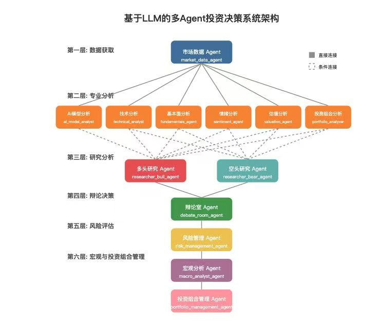

- [ ] ai荐股
  - [ ] 补充调用函数，港股价格查询、股东人数查询、筹码结构分析接口、均线系统、量价关系、指标背离、主力动向，工具调用稳定性
  - [ ] 增加行业排名、资金流向的工具
  - [ ] 增加金融数据获取api，增加东财的数据接口，更换掉 tushare
  - [ ] 支持mcp
- [ ] 持仓分析
  - [ ] 支持对单个股票分析，也要支持对整体仓位分析，给出对整体仓位调整的具体建议
- [ ] 多agent
  - [ ] 不同agent担任不同的专家
  - [ ] 多轮对话直到最终确认
- [ ] 基金自选功能
- 
- [ ] 支持openclaw远端调用
  - [ ] 使用skill-creator构造成skill，生成cli工具可以调用ai荐股功能供skill调用，支持定时运行
  - [ ] 构造手机端app
  - [ ] 支持将报告通过钉钉发送

- [ ] 持仓分析
  - [ ] 设置了买入价位和持股数量的自动划入持仓列表中，持仓列表给出分析报告，是否继续持有、补仓位、加仓位、止盈点、止损点等等